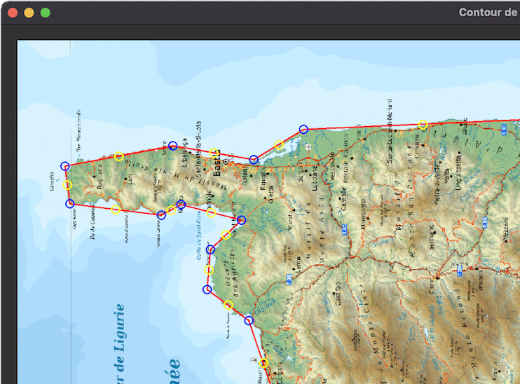

# Corsica + Breizh



## Synopsis

Outils pour établir un contour d'une image et calculer les longueurs et angles de découpe.

## Usage

### Tracer, créer le contour

```text
usage: corseqt6.py [-h] [-i IMAGE] [-p POINTS]

Tracé d'un contour

options:
  -h, --help                  show this help message and exit
  -i IMAGE, --image IMAGE     image
  -p POINTS, --points POINTS  fichier des points
```

Actions:

- `E` : bascule mode Edition
  - cercle bleu: déplace un sommet
  - cercle jaune: ajoute un segment
  - `⌫` : supprime le sommet bleu sélectionné
- `S` : sauvegarde le contour
- `L` : charge un contour
- `R` : réinitialise le contour avec les valeurs initiales
- `Q` ou `␛` : quitte le programme

## Afficher, imprimer

```text
usage: corsetex.py [-h] [-c] [-r] [-p POINTS] [-o OUTPUT] [taille] [épaisseur]

Calcule les angles et longueurs du contour de <épaisseur> mm pour une longueur totale de <taille> cm

positional arguments:
  taille                      taille du modèle en cm
  épaisseur                   épaisseur profilé en mm

options:
  -h, --help                  show this help message and exit
  -c, --contour               affiche le contour uniqument
  -r, --recto                 affiche le recto (verso par défaut)
  -p POINTS, --points POINTS  fichier de points
  -o OUTPUT, --output OUTPUT  fichier PDF généré
```

### Afficher (ancienne version)

```text
usage: corsepng.py [-h] [-m] [-o OUTPUT] [échelle] [épaisseur]

Calcule les angles et longueurs du contour de <épaisseur> mm pour une longueur totale de <échelle> cm

positional arguments:
  échelle                     hauteur du modèle en cm
  épaisseur                   épaisseur profilé en mm

options:
  -h, --help                  show this help message and exit
  -m, --model                 affiche le modèle en fond
  -o OUTPUT, --output OUTPUT  fichier PNG généré
```

## Utilisation de Docker

`corsetex.py` peut être lancé depuis un conteneur Docker avec le `Dockerfile` suivant:


```dockerfile
FROM texlive/texlive:latest
RUN apt-get update && apt-get install -y python3-numpy
COPY corsetex.py /
WORKDIR /out
ENTRYPOINT ["/corsetex.py"]
```

## Prérequis

[LaTeX](https://www.tug.org/texlive/), [Pillow](https://python-pillow.org), [numpy](https://numpy.org), [PySide6](https://doc.qt.io/qtforpython/index.html)
